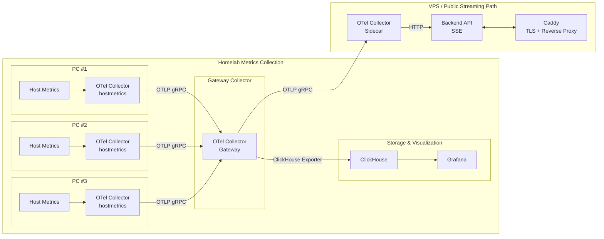

# Overview

This project sets up monitoring for my homelab.

## Metrics Collection

Each PC will run an [OTel Collector](https://opentelemetry.io/docs/collector/) as a [systemd-managed binary service](https://opentelemetry.io/docs/collector/install/binary/linux/#automatic-service-configuration) using the [host metrics receiver](https://github.com/open-telemetry/opentelemetry-collector-contrib/tree/main/receiver/hostmetricsreceiver). Each collector will use the [OTLP gRPC exporter](https://github.com/open-telemetry/opentelemetry-collector/tree/main/exporter/otlpexporter) to send metrics to a centrall deployed [gateway collector](https://opentelemetry.io/docs/collector/deployment/gateway/).

The gateway collector acts as a central aggregation point for all other collectors and is deployed on a single PC. The gateway collector will then fan out the data to multiple exporters:

1. [ClickHouse Exported:](https://github.com/open-telemetry/opentelemetry-collector-contrib/tree/main/exporter/clickhouseexporter)

    ClickHouse is self-hosted on one of the homelab PCs and serves as the long-term metrics datastore. [Grafana](https://grafana.com/grafana/plugins/grafana-clickhouse-datasource/) is also self-hosted and configured to query ClickHouse for internal visualization and analysis.

2. OTLP gRPC Exporter:

    Metrics are exported via OTLP gRPC to another OTel collector running as a sidecar alongside a backend API service. The side car collector will send metrics to the backend API service via HTTP. Both the sidecar collector and the backend API are deployed as Docker containers on a VPS. The backend API exposes a Server-Sent Events (SSE) endpoint, which streams metrics in real time to a SPA-based frontend served at `minilab.tylertries.com`.

## Hardware

HP ProDesk 600 G1 Mini x3

- Intel(R) Core(TM) i5-4590T CPU @ 2.00GHz
- 8GB RAM
- 256GB SSD