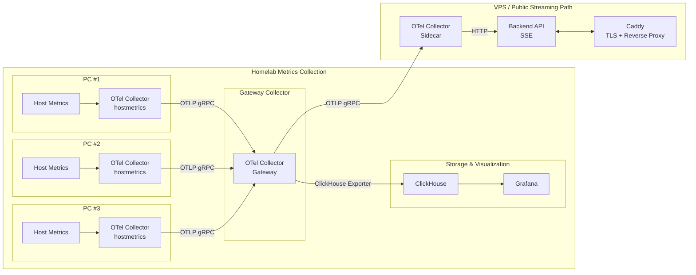

# Overview

Monorepo containing all services and infrastructure code for my homelab.

## Device Attestation

The Device Attestation Service enables secure, zero-touch onboarding of devices into the homelab environment by establishing a hardware root of trust using TPM (Trusted Platform Module) chips. During first boot, devices perform remote attestation by proving their TPM is genuine (via Endorsement Key validation), their boot state is untampered (via Platform Configuration Register measurements), and their identity is authentic (via Attestation Key certificate signing). Once validated, the attestation server issues a certificate that represents the device's trusted identity, allowing it to participate in the homelab's production workloads.

### Resources

- [How Google enforces boot integrity on production machines](https://docs.cloud.google.com/docs/security/boot-integrity#measured-boot-process)
- [Remote attestation of disaggregated machines](https://docs.cloud.google.com/docs/security/remote-attestation)
- [Securing The Edge: Onboarding Devices With Confidence](https://edgemonsters.dev/blog/secure-onboarding/)
- Brian Chambers Living on the Edge series:
    - [Part 0](https://brianchambers.substack.com/p/chamber-of-tech-secrets-45)
    - [Part I](https://brianchambers.substack.com/p/living-on-the-edge-part-i-establishing)
    - [Part II](https://brianchambers.substack.com/p/secure-device-onboarding)

## Metrics Collection

Each PC will run an [OTel Collector](https://opentelemetry.io/docs/collector/) as a [systemd-managed binary service](https://opentelemetry.io/docs/collector/install/binary/linux/#automatic-service-configuration) using the [host metrics receiver](https://github.com/open-telemetry/opentelemetry-collector-contrib/tree/main/receiver/hostmetricsreceiver). Each collector will use the [OTLP gRPC exporter](https://github.com/open-telemetry/opentelemetry-collector/tree/main/exporter/otlpexporter) to send metrics to a central deployed [gateway collector](https://opentelemetry.io/docs/collector/deployment/gateway/).

The gateway collector acts as a central aggregation point for all other collectors and is deployed on a single PC. The gateway collector will then fan out the data to multiple exporters:

1. [ClickHouse Exported:](https://github.com/open-telemetry/opentelemetry-collector-contrib/tree/main/exporter/clickhouseexporter)

   ClickHouse is self-hosted on one of the homelab PCs and serves as the long-term metrics datastore. [Grafana](https://grafana.com/grafana/plugins/grafana-clickhouse-datasource/) is also self-hosted and configured to query ClickHouse for internal visualization and analysis.

2. OTLP gRPC Exporter:

   Metrics are exported via OTLP gRPC to another OTel collector running as a sidecar alongside a backend API service. The side car collector will send metrics to the backend API service via HTTP. Both the sidecar collector and the backend API are deployed as Docker containers on a VPS. The backend API exposes a Server-Sent Events (SSE) endpoint, which streams metrics in real time to a SPA-based frontend served at `homelab.tylertries.com`.

## Hardware

| Brand | Model               | CPU                           | RAM | Storage   | Quantity |
| ----- | ------------------- | ----------------------------- | --- | --------- | -------- |
| HP    | ProDesk 600 G1 Mini | Intel Core i5-4590T @ 2.00GHz | 8GB | 256GB SSD | 3        |
